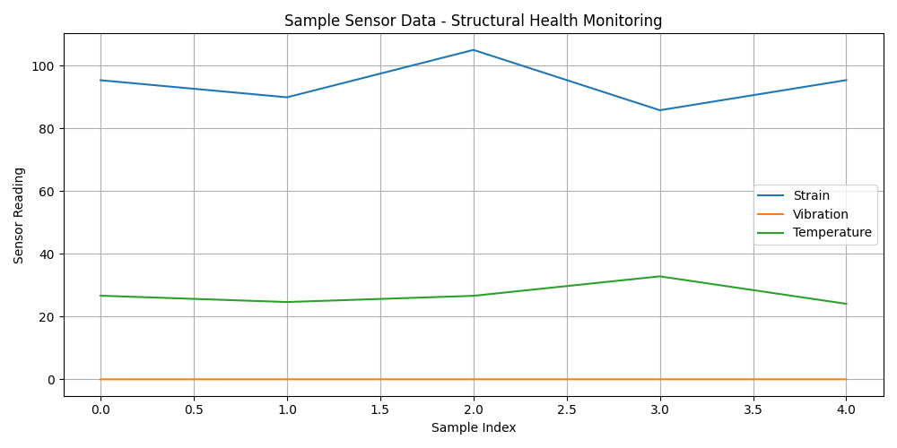

# AI-Based Structural Health Monitoring

This project demonstrates a basic AI system for detecting structural anomalies using sensor data such as strain, vibration, and temperature. It uses a Random Forest classifier to classify the condition of a structure as `No Damage`, `Crack`, or `Corrosion`.

## 🔧 Requirements

- Python 3.7+
- pandas
- numpy
- matplotlib
- scikit-learn
- openpyxl

Install dependencies using:

```bash
pip install pandas numpy matplotlib scikit-learn openpyxl
```

## 📁 Files

- `structural_health_monitoring.py`: Python script containing the ML code.
- `sample_sensor_data.xlsx`: Sample dataset with 25 rows of synthetic sensor readings.
- `output_sample_plot.png`:output plot of the sample dataset

## ▶️ How to Run

1. Ensure both `structural_health_monitoring.py` and `sample_sensor_data.xlsx` are in the same directory.
2. Open a terminal in that directory.
3. Run the script using:

```bash
python structural_health_monitoring.py
```

## 🧾 Output

### 📋 Classification Report

The script will print a classification report to the terminal. Example:

```
              precision    recall  f1-score   support
           0       1.00      1.00      1.00         4
           1       1.00      1.00      1.00         1
    accuracy                           1.00         5
   macro avg       1.00      1.00      1.00         5
weighted avg       1.00      1.00      1.00         5
```

### 📊 Sensor Data Plot

A line chart will appear showing the first 50 samples of:

* Strain
* Vibration
* Temperature

#### Example Output Plot:



> To save this image automatically, you can add this line at the end of your script:

```python
plt.savefig("output_sample_plot.png")
```

## 📊 Dataset Columns

* `strain`: Strain sensor reading (float)
* `vibration`: Vibration sensor reading (float)
* `temperature`: Temperature reading (float)
* `label`: Actual condition (`No Damage`, `Crack`, `Corrosion`)

## 🛠 Future Enhancements

* Use real-world sensor data
* Deploy as a web dashboard (Flask/Django)
* Include real-time sensor feeds with MQTT/HTTP APIs

---


